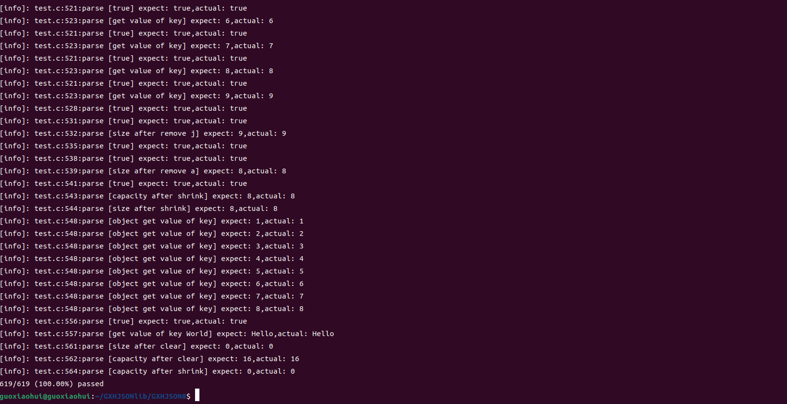

基于C实现的JSON库解析(注释与详解)
## 简介
本项目实现了一个JOSN的解析器和生成器，本项目fork 于 Milo Yip的[从零开始的 JSON 库教程](https://github.com/miloyip/json-tutorial)
原项目是一个基于测试驱动开发(test driven development,TDD)的项目，结合宏函数写好测试用例以及预期得到的结果，然后根据想要得到的解析结果去开发接口，实现功能。原项目从最简单的 解析 null 开始，一步一步增加解析的功能，到最后完成各种扩展，一共分为八部分，每个部分分为两节（半成品+习题解答），本项目将每个部分的两个小节合成一部分。并且在test测试这块做了一些重构，可以看到每个测试用例的输入输出结果。
## JSON简介
JSON（JavaScript Object Notation）是一个用于数据交换的文本格式，现时的标准为ECMA-404。

虽然 JSON 源至于 JavaScript 语言，但它只是一种数据格式，可用于任何编程语言。现时具类似功能的格式有 XML、YAML，当中以 JSON 的语法最为简单。
JSON 是树状结构，而 JSON 只包含 6 种数据类型：

- null: 表示为 null
- boolean: 表示为 true 或 false
- number: 一般的浮点数表示方式，在下一单元详细说明
- string: 表示为 "..."
- array: 表示为 [ ... ]
- object: 表示为 { ... }

> 解析的类型判断主要是分析第一个字符是什么，以确定解析的是什么数据类型
## 目录介绍
- GXHJSON1  解析NULL，TRUE，FALSE三种数据类型
- GXHJSON2  解析数字类型
- GXHJSON3  解析字符串类型
- GXHJSON4  JSON字符串中unicode的解析
- GXHJSON5  解析数组
- GXHJSON6  解析对象
- GXHJSON7  JSON生成器，解析JSON的逆操作
- GXHJSON8  array和object类型的功能扩充，实现动态大小类型，并且可以修改。以及数据的拷贝、移动、相等判断等操作
- preview 每一节对应的文档
## 主要功能
- 把 JSON 文本解析成为一个树状数据结构(parse).
- 提供接口访问该数据接口(access).
- 把数据结构转换为JSON文本.(stringify).
```C
typedef struct lept_value lept_value;
typedef struct lept_member lept_member;
struct lept_value{
    union{
        double n;                               /*number*/
        struct{                                 /*string:null-terminated string, string length*/
            char* s;
            size_t len;
        }s;
        struct {                                 /* array:  elements, element count */
            lept_value* e;
            size_t size, capacity;
        }a;
        struct{                                 /* object: members, member count */
            lept_member* m;
            size_t size, capacity;
        }o;
    }u;
    lept_type type;
} ;

struct lept_member{
    char* k;                /*member key string*/
    size_t klen;            /*key string length*/
    lept_value v;            /* member value */
};
```
## demo演示
> 测试环境 Ubutun

## 快速运行
- 编译
```shell
gcc test.c leptjson.c -o test
```
- 启动
```shell
./test
```
## 用途
JSON是一种起源于javascript的数据结构，但是可以应用于各种编程语言，和其他数据结构比起来，JSON的数据存储相对简单，高效，七种数据类型便可以满足我们大部分的需求。我们在传输数据时一般是可以把要传输的数据转化为JSON的字符串(stringify),在接收方，将JSON字符串在解析成JSON树对象(parse)，然后将里面的数据存储为适合的数据结构里面。所以，实现一个JSON解析库是很有必要且有意义的。
## 难点
- 对于数据的存储需要自己管理内存，释放内存，对于内存管理有一定的要求
- JSON 数组和 JSON 对象语法简单，实现的难点不在于语法，而在于管理内存，为了方便管理，这里采用了 动态数组的数据结构来管理内存
- 在实现解析 string 类型时，需要考虑转义字符，除了常见的\n等，还需要对0x00~0x1F做特殊处理，并且对于\uXXXX这种转义字符转换为UTF-8的格式(需要先计算出码点，然后根据码点的范围转换为指定个数的字符)
- 需要考虑各种数据格式出错的情况并释放缓冲区的数据
- 通过union联合体存储不同类型的数据，在操作时需要判断好当前数据结构存储的数据类型，否则会出现未知的错误，所以本项目用到了很多assert去判断
- 在单元测试模块，没有采取print/cout 的打印方式，而是采取 TDD 的思想，结合宏函数，判断输出结果是否与预期结果一致并结合 __LINE__ 打印出错的位置。
- 通过一个动态堆栈作为缓冲区来存取解析字符串、数组、对象时的临时值。在解析这几种数据结构时，由于不知道长度，并且需要进行字符转义，所以需要一个临时缓冲区，为此实现了一个动态增长的堆栈，可以不断压入解析的结构，最后一次性把整个数据弹出，复制进新分配的内存之中
## 不足
1.对于字符串的转义字符只支持UTF-8编码

2.对于将JSON树 转换为 JSON文本没有做格式化，生成的 JSON 会是单行、无空白字符的最紧凑形式。