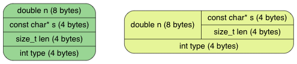

解析字符串

## 1.JSON字符串语法
JSON 的字符串语法和 C 语言很相似，都是以双引号把字符括起来，如 "Hello"。但字符串采用了双引号作分隔，那么怎样可以在字符串中插入一个双引号？ 把 a"b 写成 "a"b" 肯定不行，都不知道那里是字符串的结束了。因此，我们需要引入转义字符（escape character），C 语言和 JSON 都使用 \（反斜线）作为转义字符，那么 " 在字符串中就表示为 \"，a"b 的 JSON 字符串则写成 "a\"b"。如以下的字符串语法所示，JSON 共支持 9 种转义序列：
```C
string = quotation-mark *char quotation-mark
char = unescaped /
   escape (
       %x22 /          ; "    quotation mark  U+0022
       %x5C /          ; \    reverse solidus U+005C
       %x2F /          ; /    solidus         U+002F
       %x62 /          ; b    backspace       U+0008
       %x66 /          ; f    form feed       U+000C
       %x6E /          ; n    line feed       U+000A
       %x72 /          ; r    carriage return U+000D
       %x74 /          ; t    tab             U+0009
       %x75 4HEXDIG )  ; uXXXX                U+XXXX
escape = %x5C          ; \
quotation-mark = %x22  ; "
unescaped = %x20-21 / %x23-5B / %x5D-10FFFF
```
简单翻译一下，JSON 字符串是由前后两个双引号夹着零至多个字符。字符分为无转义字符或转义序列。转义序列有 9 种，都是以反斜线开始，如常见的 \n 代表换行符。比较特殊的是 \uXXXX，当中 XXXX 为 16 进位的 UTF-16 编码，本单元将不处理这种转义序列，留待下回分解。

无转义字符就是普通的字符，语法中列出了合法的码点范围（码点还是在下单元才介绍）。要注意的是，该范围不包括 0 至 31、双引号和反斜线，这些码点都必须要使用转义方式表示。
## 2.字符串表示
在 C 语言中，字符串一般表示为空结尾字符串（null-terminated string），即以空字符（'\0'）代表字符串的结束。然而，JSON 字符串是允许含有空字符的，例如这个 JSON "Hello\u0000World" 就是单个字符串，解析后为11个字符。如果纯粹使用空结尾字符串来表示 JSON 解析后的结果，就没法处理空字符。

因此，我们可以分配内存来储存解析后的字符，以及记录字符的数目（即字符串长度）。由于大部分 C 程序都假设字符串是空结尾字符串，我们还是在最后加上一个空字符，那么不需处理 \u0000 这种字符的应用可以简单地把它当作是空结尾字符串。

了解需求后，我们考虑实现。lept_value 事实上是一种变体类型（variant type），我们通过 type 来决定它现时是哪种类型，而这也决定了哪些成员是有效的。首先我们简单地在这个结构中加入两个成员：
```C
typedef struct {
    char* s;
    size_t len;
    double n;
    lept_type type;
}lept_value;
```
然而我们知道，一个值不可能同时为数字和字符串，因此我们可使用 C 语言的 union 来节省内存：
```C
typedef struct {
    union {
        struct { char* s; size_t len; }s;  /* string */
        double n;                          /* number */
    }u;
    lept_type type;
}lept_value;
```
这两种设计在 32 位平台时的内存布局如下，可看出右方使用 union 的能省下内存.

我们要把之前的 v->n 改成 v->u.n。而要访问字符串的数据，则要使用 v->u.s.s 和 v->u.s.len。这种写法比较麻烦吧，其实 C11 新增了匿名 struct/union 语法，就可以采用 v->n、v->s、v->len 来作访问。
## 3.内存管理
由于字符串的长度不是固定的，我们要动态分配内存。为简单起见，我们使用标准库 <stdlib.h> 中的 malloc()、realloc() 和 free() 来分配／释放内存。

当设置一个值为字符串时，我们需要把参数中的字符串复制一份：
```C
void lept_set_string(lept_value* v, const char* s, size_t len) {
    assert(v != NULL && (s != NULL || len == 0));
    lept_free(v);
    v->u.s.s = (char*)malloc(len + 1);
    memcpy(v->u.s.s, s, len);
    v->u.s.s[len] = '\0';
    v->u.s.len = len;
    v->type = LEPT_STRING;
}
```
断言中的条件是，非空指针（有具体的字符串）或是零长度的字符串都是合法的。

注意，在设置这个 v 之前，我们需要先调用 lept_free(v) 去清空 v 可能分配到的内存。例如原来已有一字符串，我们要先把它释放。然后就是简单地用 malloc() 分配及用 memcpy() 复制，并补上结尾空字符。malloc(len + 1) 中的 1 是因为结尾空字符。

那么，再看看 lept_free()：
```C
void lept_free(lept_value* v) {
    assert(v != NULL);
    if (v->type == LEPT_STRING)
        free(v->u.s.s);
    v->type = LEPT_NULL;
}
```
现时仅当值是字符串类型，我们才要处理，之后我们还要加上对数组及对象的释放。lept_free(v) 之后，会把它的类型变成 null。这个设计能避免重复释放。

但也由于我们会检查 v 的类型，在调用所有访问函数之前，我们必须初始化该类型。所以我们加入 lept_init(v)，因非常简单我们用宏实现：
```C
#define lept_init(v) do { (v)->type = LEPT_NULL; } while(0)
```
用上 do { ... } while(0) 是为了把表达式转为语句，模仿无返回值的函数。

其实在前两个单元中，我们只提供读取值的 API，没有写入的 API，就是因为写入时我们还要考虑释放内存。我们在本单元中把它们补全：
```C
#define lept_set_null(v) lept_free(v)

int lept_get_boolean(const lept_value* v);
void lept_set_boolean(lept_value* v, int b);

double lept_get_number(const lept_value* v);
void lept_set_number(lept_value* v, double n);

const char* lept_get_string(const lept_value* v);
size_t lept_get_string_length(const lept_value* v);
void lept_set_string(lept_value* v, const char* s, size_t len);
```
由于 lept_free() 实际上也会把 v 变成 null 值，我们只用一个宏来提供 lept_set_null() 这个 API。

应用方的代码在调用 lept_parse() 之后，最终也应该调用 lept_free() 去释放内存。我们把之前的单元测试也加入此调用。

如果不使用 lept_parse()，我们需要初始化值，那么就像以下的单元测试，先 lept_init()，最后 lept_free()。
```C
static void test_access_string() {
    lept_value v;
    lept_init(&v);
    lept_set_string(&v, "", 0);
    EXPECT_EQ_STRING("", lept_get_string(&v), lept_get_string_length(&v));
    lept_set_string(&v, "Hello", 5);
    EXPECT_EQ_STRING("Hello", lept_get_string(&v), lept_get_string_length(&v));
    lept_free(&v);
}
```
## 4.缓冲区与堆栈
我们解析字符串（以及之后的数组、对象）时，需要把解析的结果先储存在一个临时的缓冲区，最后再用 lept_set_string() 把缓冲区的结果设进值之中。在完成解析一个字符串之前，这个缓冲区的大小是不能预知的。因此，我们可以采用动态数组（dynamic array）这种数据结构，即数组空间不足时，能自动扩展。C++ 标准库的 std::vector 也是一种动态数组。

如果每次解析字符串时，都重新建一个动态数组，那么是比较耗时的。我们可以重用这个动态数组，每次解析 JSON 时就只需要创建一个。而且我们将会发现，无论是解析字符串、数组或对象，我们也只需要以先进后出的方式访问这个动态数组。换句话说，我们需要一个动态的堆栈（stack）数据结构。

我们把一个动态堆栈的数据放进 lept_context 里：
```C
typedef struct {
    const char* json;
    char* stack;
    size_t size, top;
}lept_context;
```
当中 size 是当前的堆栈容量，top 是栈顶的位置（由于我们会扩展 stack，所以不要把 top 用指针形式存储）。

然后，我们在创建 lept_context 的时候初始化 stack 并最终释放内存：
```C
int lept_parse(lept_value* v, const char* json) {
    lept_context c;
    int ret;
    assert(v != NULL);
    c.json = json;
    c.stack = NULL;        /* <- */
    c.size = c.top = 0;    /* <- */
    lept_init(v);
    lept_parse_whitespace(&c);
    if ((ret = lept_parse_value(&c, v)) == LEPT_PARSE_OK) {
        /* ... */
    }
    assert(c.top == 0);    /* <- */
    free(c.stack);         /* <- */
    return ret;
}
```
在释放时，加入了断言确保所有数据都被弹出。

然后，我们实现堆栈的压入及弹出操作。和普通的堆栈不一样，我们这个堆栈是以字节储存的。每次可要求压入任意大小的数据，它会返回数据起始的指针：
```C
#ifndef LEPT_PARSE_STACK_INIT_SIZE
#define LEPT_PARSE_STACK_INIT_SIZE 256
#endif

static void* lept_context_push(lept_context* c, size_t size) {
    void* ret;
    assert(size > 0);
    if (c->top + size >= c->size) {
        if (c->size == 0)
            c->size = LEPT_PARSE_STACK_INIT_SIZE;
        while (c->top + size >= c->size)
            c->size += c->size >> 1;  /* c->size * 1.5 */
        c->stack = (char*)realloc(c->stack, c->size);
    }
    ret = c->stack + c->top;
    c->top += size;
    return ret;
}

static void* lept_context_pop(lept_context* c, size_t size) {
    assert(c->top >= size);
    return c->stack + (c->top -= size);
}
```
压入时若空间不足，便回以 1.5 倍大小扩展。为什么是 1.5 倍而不是两倍？可参考我在 STL 的 vector 有哪些封装上的技巧？ 的答案。

注意到这里使用了 realloc() 来重新分配内存，c->stack 在初始化时为 NULL，realloc(NULL, size) 的行为是等价于 malloc(size) 的，所以我们不需要为第一次分配内存作特别处理。

另外，我们把初始大小以宏 LEPT_PARSE_STACK_INIT_SIZE 的形式定义，使用 #ifndef X #define X ... #endif 方式的好处是，使用者可在编译选项中自行设置宏，没设置的话就用缺省值。
## 5.解析字符串
有了以上的工具，解析字符串的任务就变得很简单。我们只需要先备份栈顶，然后把解析到的字符压栈，最后计算出长度并一次性把所有字符弹出，再设置至值里便可以。以下是部分实现，没有处理转义和一些不合法字符的校验。
```C
#define PUTC(c, ch) do { *(char*)lept_context_push(c, sizeof(char)) = (ch); } while(0)

static int lept_parse_string(lept_context* c, lept_value* v) {
    size_t head = c->top, len;
    const char* p;
    EXPECT(c, '\"');
    p = c->json;
    for (;;) {
        char ch = *p++;
        switch (ch) {
            case '\"':
                len = c->top - head;
                lept_set_string(v, (const char*)lept_context_pop(c, len), len);
                c->json = p;
                return LEPT_PARSE_OK;
            case '\0':
                c->top = head;
                return LEPT_PARSE_MISS_QUOTATION_MARK;
            default:
                PUTC(c, ch);
        }
    }
}
```

## 总结
JSON字符串由前后两个双引号夹着零至多个字符，字符分为无转义字符和转义序列，转义序列由9种，都是以反斜线开始，如\n,比较特殊的事\uXXXX,当中XXXX为16进位的UTF-16编码。无转义字符就是普通的字符，语法中列出了合法的码点范围，该范围不包括0~31，双引号和反斜线，这些码点需要转义方式表示。

在解析字符串时需要记录字符串的长度，因为字符串是可以存在空字符的，所以为了正确读取解析的字符串，不能以 \0为结束点，而通过记录字符串的长度来读取。由于字符串的长度不是确定的，所以需要通过malloc动态分配内存。

在解析字符串（数组，对象）时，需要把解析的结果先存储在一份临时的缓冲区中，最后再把缓冲区中的数据读取到我们的数据结构中。由于缓冲区的大小时未知的，所以我们采用动态数组（这里采用一个动态堆栈）这种数据结构，然后还有一个top和size指针，通过push和pop来改变top的位置（得到的是即将存取或弹出数据的内存地址）。(在解析完成时加上断言top为0，以保证缓冲区的数据都得到了释放，防止内存泄露)。

解析 JSON 字符串时，因为在开始时不能知道字符串的长度，而又需要进行转义，所以需要一个临时缓冲区去存储解析后的结果。我们为此实现了一个动态增长的堆栈，可以不断压入字符，最后一次性把整个字符串弹出，复制至新分配的内存之中。

WINDOW下通过CRT来检测内存泄漏，Linux 通过 valgrind来检测内存泄漏(apt-get install valgrind、 brew install valgrind)

合法字符 ：unescaped = %x20-21 / %x23-5B / %x5D-10FFFF 
其中：%x22 是双引号，%x5C 是反斜线  %x00 至 %x1F 需要特殊处理

- 性能优化
    - 如果整个字符串都没有转义符，我们不就是把字符复制了两次？第一次是从 json 到 stack，第二次是从 stack 到 v->u.s.s。我们可以在 json 扫描 '\0'、'\"' 和 '\\' 3 个字符（ ch < 0x20 还是要检查），直至它们其中一个出现，才开始用现在的解析方法。这样做的话，前半没转义的部分可以只复制一次。缺点是，代码变得复杂一些，我们也不能使用 lept_set_string()。
    - 对于扫描没转义部分，我们可考虑用 SIMD 加速，如 RapidJSON 代码剖析（二）：使用 SSE4.2 优化字符串扫描 的做法。这类底层优化的缺点是不跨平台，需要设置编译选项等。
    - 在 gcc/clang 上使用 __builtin_expect() 指令来处理低概率事件，例如需要对每个字符做 LEPT_PARSE_INVALID_STRING_CHAR 检测，我们可以假设出现不合法字符是低概率事件，然后用这个指令告之编译器，那么编译器可能可生成较快的代码。然而，这类做法明显是不跨编译器，甚至是某个版本后的 gcc 才支持。