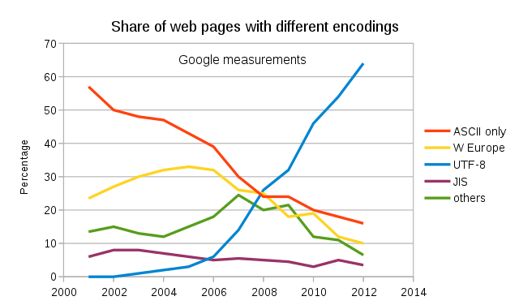

Unicode

## 1.Unicode 1.统一码
在上一个单元，我们已经能解析「一般」的 JSON 字符串，仅仅没有处理 \uXXXX 这种转义序列。为了解析这种序列，我们必须了解有关 Unicode 的基本概念。

读者应该知道 ASCII，它是一种字符编码，把 128 个字符映射至整数 0 ~ 127。例如，1 → 49，A → 65，B → 66 等等。这种 7-bit 字符编码系统非常简单，在计算机中以一个字节存储一个字符。然而，它仅适合美国英语，甚至一些英语中常用的标点符号、重音符号都不能表示，无法表示各国语言，特别是中日韩语等表意文字。

在 Unicode 出现之前，各地区制定了不同的编码系统，如中文主要用 GB 2312 和大五码、日文主要用 JIS 等。这样会造成很多不便，例如一个文本信息很难混合各种语言的文字。

因此，在上世纪80年代末，Xerox、Apple 等公司开始研究，是否能制定一套多语言的统一编码系统。后来，多个机构成立了 Unicode 联盟，在 1991 年释出 Unicode 1.0，收录了 24 种语言共 7161 个字符。在四分之一个世纪后的 2016年，Unicode 已释出 9.0 版本，收录 135 种语言共 128237 个字符。

这些字符被收录为统一字符集（Universal Coded Character Set, UCS），每个字符映射至一个整数码点（code point），码点的范围是 0 至 0x10FFFF，码点又通常记作 U+XXXX，当中 XXXX 为 16 进位数字。例如 劲 → U+52B2、峰 → U+5CF0。很明显，UCS 中的字符无法像 ASCII 般以一个字节存储。

因此，Unicode 还制定了各种储存码点的方式，这些方式称为 Unicode 转换格式（Uniform Transformation Format, UTF）。现时流行的 UTF 为 UTF-8、UTF-16 和 UTF-32。每种 UTF 会把一个码点储存为一至多个编码单元（code unit）。例如 UTF-8 的编码单元是 8 位的字节、UTF-16 为 16 位、UTF-32 为 32 位。除 UTF-32 外，UTF-8 和 UTF-16 都是可变长度编码。

UTF-8 成为现时互联网上最流行的格式，有几个原因：

- 它采用字节为编码单元，不会有字节序（endianness）的问题。
- 每个 ASCII 字符只需一个字节去储存。
- 如果程序原来是以字节方式储存字符，理论上不需要特别改动就能处理 UTF-8 的数据。

## 2.需求
由于 UTF-8 的普及性，大部分的 JSON 也通常会以 UTF-8 存储。我们的 JSON 库也会只支持 UTF-8。（RapidJSON 同时支持 UTF-8、UTF-16LE/BE、UTF-32LE/BE、ASCII。）

C 标准库没有关于 Unicode 的处理功能（C++11 有），我们会实现 JSON 库所需的字符编码处理功能。

对于非转义（unescaped）的字符，只要它们不少于 32（0 ~ 31 是不合法的编码单元），我们可以直接复制至结果，这一点我们稍后再说明。我们假设输入是以合法 UTF-8 编码。

而对于 JSON字符串中的 \uXXXX 是以 16 进制表示码点 U+0000 至 U+FFFF，我们需要：

- 解析 4 位十六进制整数为码点；
- 由于字符串是以 UTF-8 存储，我们要把这个码点编码成 UTF-8。

同学可能会发现，4 位的 16 进制数字只能表示 0 至 0xFFFF，但之前我们说 UCS 的码点是从 0 至 0x10FFFF，那怎么能表示多出来的码点？

其实，U+0000 至 U+FFFF 这组 Unicode 字符称为基本多文种平面（basic multilingual plane, BMP），还有另外 16 个平面。那么 BMP 以外的字符，JSON 会使用代理对（surrogate pair）表示 \uXXXX\uYYYY。在 BMP 中，保留了 2048 个代理码点。如果第一个码点是 U+D800 至 U+DBFF，我们便知道它的代码对的高代理项（high surrogate），之后应该伴随一个 U+DC00 至 U+DFFF 的低代理项（low surrogate）。然后，我们用下列公式把代理对 (H, L) 变换成真实的码点：
```C
codepoint = 0x10000 + (H − 0xD800) × 0x400 + (L − 0xDC00)
```
举个例子，高音谱号字符 𝄞 → U+1D11E 不是 BMP 之内的字符。在 JSON 中可写成转义序列 \uD834\uDD1E，我们解析第一个 \uD834 得到码点 U+D834，我们发现它是 U+D800 至 U+DBFF 内的码点，所以它是高代理项。然后我们解析下一个转义序列 \uDD1E 得到码点 U+DD1E，它在 U+DC00 至 U+DFFF 之内，是合法的低代理项。我们计算其码点：
```C
H = 0xD834, L = 0xDD1E
codepoint = 0x10000 + (H − 0xD800) × 0x400 + (L − 0xDC00)
          = 0x10000 + (0xD834 - 0xD800) × 0x400 + (0xDD1E − 0xDC00)
          = 0x10000 + 0x34 × 0x400 + 0x11E
          = 0x10000 + 0xD000 + 0x11E
          = 0x1D11E
```
这样就得出这转义序列的码点，然后我们再把它编码成 UTF-8。如果只有高代理项而欠缺低代理项，或是低代理项不在合法码点范围，我们都返回 LEPT_PARSE_INVALID_UNICODE_SURROGATE 错误。如果 \u 后不是 4 位十六进位数字，则返回 LEPT_PARSE_INVALID_UNICODE_HEX 错误。

## 3.UTF-8 编码
UTF-8 在网页上的使用率势无可挡：

由于我们的 JSON 库也只支持 UTF-8，我们需要把码点编码成 UTF-8。这里简单介绍一下 UTF-8 的编码方式。

UTF-8 的编码单元为 8 位（1 字节），每个码点编码成 1 至 4 个字节。它的编码方式很简单，按照码点的范围，把码点的二进位分拆成 1 至最多 4 个字节：
|码点范围	|码点位数	|字节1|	字节2|	字节3|	字节4|
|--|--|--|--|--|--|
|U+0000 ~ U+007F U+0000~U+007F	|7	|0xxxxxxx 0xxxxxxx			
|U+0080 ~ U+07FF U+0080 ~ U+07FF|11	|110xxxxx 110xxxxx	|10xxxxxx 10xxxxxx		
|U+0800 ~ U+FFFF U+0800 ~ U+FFFF	|16|	1110xxxx 1110xxxx	|10xxxxxx 10xxxxxx	|10xxxxxx 10xxxxxx	
|U+10000 ~ U+10FFFF U+10000 ~ U+10FFFF	|21	|11110xxx 11110xxx	|10xxxxxx 10xxxxxx	|10xxxxxx 10xxxxxx	|10xxxxxx 10xxxxxx

这个编码方法的好处之一是，码点范围 U+0000 ~ U+007F 编码为一个字节，与 ASCII 编码兼容。这范围的 Unicode 码点也是和 ASCII 字符相同的。因此，一个 ASCII 文本也是一个 UTF-8 文本。

我们举一个例子解析多字节的情况，欧元符号 € → U+20AC：

- U+20AC 在 U+0800 ~ U+FFFF 的范围内，应编码成 3 个字节。
- U+20AC 的二进位为 10000010101100
- 3 个字节的情况我们要 16 位的码点，所以在前面补两个 0，成为 0010000010101100
- 按上表把二进位分成 3 组：0010, 000010, 101100
- 加上每个字节的前缀：11100010, 10000010, 10101100
-用十六进位表示即：0xE2, 0x82, 0xAC

对于这例子的范围，对应的 C 代码是这样的：
```C
if (u >= 0x0800 && u <= 0xFFFF) {
    OutputByte(0xE0 | ((u >> 12) & 0xFF)); /* 0xE0 = 11100000 */
    OutputByte(0x80 | ((u >>  6) & 0x3F)); /* 0x80 = 10000000 */
    OutputByte(0x80 | ( u        & 0x3F)); /* 0x3F = 00111111 */
}
```

## 4.实现\uXXXX解析
我们只需要在其它转义符的处理中加入对 \uXXXX 的处理：
```C
static int lept_parse_string(lept_context* c, lept_value* v) {
    unsigned u;
    /* ... */
    for (;;) {
        char ch = *p++;
        switch (ch) {
            /* ... */
            case '\\':
                switch (*p++) {
                    /* ... */
                    case 'u':
                        if (!(p = lept_parse_hex4(p, &u)))
                            STRING_ERROR(LEPT_PARSE_INVALID_UNICODE_HEX);
                        /* \TODO surrogate handling */
                        lept_encode_utf8(c, u);
                        break;
                    /* ... */
                }
            /* ... */
        }
    }
}
```
上面代码的过程很简单，遇到 \u 转义时，调用 lept_parse_hex4() 解析 4 位十六进数字，存储为码点 u。这个函数在成功时返回解析后的文本指针，失败返回 NULL。如果失败，就返回 LEPT_PARSE_INVALID_UNICODE_HEX 错误。最后，把码点编码成 UTF-8，写进缓冲区。这里没有处理代理对，留作练习。

顺带一提，我为 lept_parse_string() 做了个简单的重构，把返回错误码的处理抽取为宏：
```C
#define STRING_ERROR(ret) do { c->top = head; return ret; } while(0)
```
## 问题
4 位的 16 进制数字只能表示 0 至 0xFFFF，但之前我们说 UCS 的码点是从 0 至 0x10FFFF，那怎么能表示多出来的码点？

其实，U+0000 至 U+FFFF 这组 Unicode 字符称为基本多文种平面（basic multilingual plane, BMP），还有另外 16 个平面。那么 BMP 以外的字符，JSON 会使用代理对（surrogate pair）表示 \uXXXX\uYYYY。在 BMP 中，保留了 2048 个代理码点。如果第一个码点是 U+D800 至 U+DBFF，我们便知道它的代码对的高代理项（high surrogate），之后应该伴随一个 U+DC00 至 U+DFFF 的低代理项（low surrogate）。然后，我们用下列公式把代理对 (H, L) 变换成真实的码点：

codepoint = 0x10000 + (H − 0xD800) × 0x400 + (L − 0xDC00)

举个例子，高音谱号字符 𝄞 → U+1D11E 不是 BMP 之内的字符。在 JSON 中可写成转义序列 \uD834\uDD1E，我们解析第一个 \uD834 得到码点 U+D834，我们发现它是 U+D800 至 U+DBFF 内的码点，所以它是高代理项。然后我们解析下一个转义序列 \uDD1E 得到码点 U+DD1E，它在 U+DC00 至 U+DFFF 之内，是合法的低代理项。我们计算其码点：

H = 0xD834, L = 0xDD1E
codepoint = 0x10000 + (H − 0xD800) × 0x400 + (L − 0xDC00)
          = 0x10000 + (0xD834 - 0xD800) × 0x400 + (0xDD1E − 0xDC00)
          = 0x10000 + 0x34 × 0x400 + 0x11E
          = 0x10000 + 0xD000 + 0x11E
          = 0x1D11E

- 在解析16 进制数据的时候，没有采用标准库strtol的原因？

但这个实现会错误地接受 "\u 123" 这种不合法的 JSON，因为 strtol() 会跳过开始的空白。要解决的话，还需要检测第一个字符是否 [0-9A-Fa-f]，或者 !isspace(*p)。但为了 strtol() 做多余的检测，而且自行实现也很简单，我个人会选择首个方案。（前两个单元用 strtod() 就没办法，因为它的实现要复杂得多。）

- 高位的几个数字为什么要做 x & 0xFF 这种操作呢？

这是因为 u 是 unsigned 类型，一些编译器可能会警告这个转型可能会截断数据。但实际上，配合了范围的检测然后右移之后，可以保证写入的是 0~255 内的值。为了避免一些编译器的警告误判，我们加上 x & 0xFF。一般来说，编译器在优化之后，这与操作是会被消去的，不会影响性能。
## 总结
对于字符串的解析有一些转义字符，例如\n等，还有%x00 ~ %x1F，这些已经做过判断，本节完成了对于\uXXXX这种转义序列的处理。

ASCII存在一定局限性，不能表示其他各国的字符，为了指定一套多语言的统一编码系统，出现了Unicode，这些字符被收录为统一字符集（Universal Coded Character Set, UCS），每个字符映射至一个整数码点（code point），码点的范围是 0 至 0x10FFFF，码点又通常记作 U+XXXX，当中 XXXX 为 16 进位数字。Unicode 还制定了各种储存码点的方式，这些方式称为 Unicode 转换格式（Uniform Transformation Format, UTF）。现时流行的 UTF 为 UTF-8、UTF-16 和 UTF-32。每种 UTF 会把一个码点储存为一至多个编码单元（code unit）。例如 UTF-8 的编码单元是 8 位的字节、UTF-16 为 16 位、UTF-32 为 32 位。除 UTF-32 外，UTF-8 和 UTF-16 都是可变长度编码。

Unicode：是一种字符集，包含了一套多语言的统一编码系统

UTF：unicode的转换格式，将unicode码点存储为一至多个编码单元

码点：每一个字符对应于一个码点 码点的范围是 0 至 0x10FFFF

编码单元：每种 UTF 会把一个码点储存为一至多个编码单元（code unit）。例如 UTF-8 的编码单元是 8 位的字节、UTF-16 为 16 位、UTF-32 为 32 位。除 UTF-32 外，UTF-8 和 UTF-16 都是可变长度编码

UTF-8：是一种unicode的转换格式，用来存储码点。

代理对：U+0000 至 U+FFFF 这组 Unicode 字符称为基本多文种平面（basic multilingual plane, BMP）。BMP 以外的字符，JSON 会使用代理对（surrogate pair）表示 \uXXXX\uYYYY。在 BMP 中，保留了 2048 个代理码点。如果第一个码点是 U+D800 至 U+DBFF，我们便知道它的代码对的高代理项（high surrogate），之后应该伴随一个 U+DC00 至 U+DFFF 的低代理项（low surrogate）。

对于非转义字符（0~31除外），我们可以直接复制至结果，对于JSON字符串中的\uXXXX是以16禁止表示码点U+0000至U+FFFF，我们需要解析4位十六进制的码点，由于字符串是以UTF-8存储的，我们要把这个码点编码成UTF-8.

使用 Unicode 标准去处理文本数据已是世界潮流。虽然 C11/C++11 引入了 Unicode 字符串字面量及少量函数，但仍然有很多不足，一般需要借助第三方库。

- 解析顺序
首先将转义\uXXXX格式转换为十六进制的unsigned值，然后如果为BMP的保留字段，则继续解析低代理项，生成该字符对应的Unicode码点，然后按照UTF-8的标准将码点解析成指定个数的编码单元。
