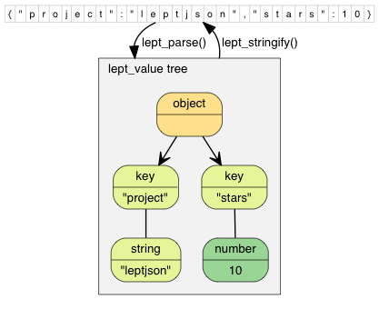

生成器
## 1.JSON生成器
我们在前 6 个单元实现了一个合乎标准的 JSON 解析器，它把 JSON 文本解析成一个树形数据结构，整个结构以 lept_value 的节点组成。

JSON 生成器（generator）负责相反的事情，就是把树形数据结构转换成 JSON 文本。这个过程又称为「字符串化（stringify）」。

相对于解析器，通常生成器更容易实现，而且生成器几乎不会造成运行时错误。因此，生成器的 API 设计为以下形式，直接返回 JSON 的字符串：
```C
char* lept_stringify(const lept_value* v, size_t* length);
```
length 参数是可选的，它会存储 JSON 的长度，传入 NULL 可忽略此参数。使用方需负责用 free() 释放内存。

为了简单起见，我们不做换行、缩进等美化（prettify）处理，因此它生成的 JSON 会是单行、无空白字符的最紧凑形式。
## 2.再利用lept_context 做动态数组
在实现 JSON 解析时，我们加入了一个动态变长的堆栈，用于存储临时的解析结果。而现在，我们也需要存储生成的结果，所以最简单是再利用该数据结构，作为输出缓冲区。
```C
#ifndef LEPT_PARSE_STRINGIFY_INIT_SIZE
#define LEPT_PARSE_STRINGIFY_INIT_SIZE 256
#endif

int lept_stringify(const lept_value* v, char** json, size_t* length) {
    lept_context c;
    int ret;
    assert(v != NULL);
    assert(json != NULL);
    c.stack = (char*)malloc(c.size = LEPT_PARSE_STRINGIFY_INIT_SIZE);
    c.top = 0;
    if ((ret = lept_stringify_value(&c, v)) != LEPT_STRINGIFY_OK) {
        free(c.stack);
        *json = NULL;
        return ret;
    }
    if (length)
        *length = c.top;
    PUTC(&c, '\0');
    *json = c.stack;
    return LEPT_STRINGIFY_OK;
}
```
生成根节点的值之后，我们还需要加入一个空字符作结尾。

如前所述，此 API 还提供了 length 可选参数，当传入非空指针时，就能获得生成 JSON 的长度。或许读者会疑问，为什么需要获得长度，我们不是可以用 strlen() 获得么？是的，因为 JSON 不会含有空字符（若 JSON 字符串中含空字符，必须转义为 \u0000），用 strlen() 是没有问题的。但这样做会带来不必要的性能消耗，理想地是避免调用方有额外消耗。
## 3.生成null、false和true
接下来，我们生成最简单的 JSON 类型，就是 3 种 JSON 字面值。为贯彻 TDD，先写测试：
```C
#define TEST_ROUNDTRIP(json)\
    do {\
        lept_value v;\
        char* json2;\
        size_t length;\
        lept_init(&v);\
        EXPECT_EQ_INT(LEPT_PARSE_OK, lept_parse(&v, json));\
        EXPECT_EQ_INT(LEPT_STRINGIFY_OK, lept_stringify(&v, &json2, &length));\
        EXPECT_EQ_STRING(json, json2, length);\
        lept_free(&v);\
        free(json2);\
    } while(0)

static void test_stringify() {
    TEST_ROUNDTRIP("null");
    TEST_ROUNDTRIP("false");
    TEST_ROUNDTRIP("true");
    /* ... */
}
```
这里我们采用一个最简单的测试方式，把一个 JSON 解析，然后再生成另一 JSON，逐字符比较两个 JSON 是否一模一样。这种测试可称为往返（roundtrip）测试。但需要注意，同一个 JSON 的内容可以有多种不同的表示方式，例如可以插入不定数量的空白字符，数字 1.0 和 1 也是等价的。所以另一种测试方式，是比较两次解析的结果（lept_value 的树）是否相同，此功能将会在下一单元讲解。

然后，我们实现 lept_stringify_value，加入一个 PUTS() 宏去输出字符串：
```C
#define PUTS(c, s, len)     memcpy(lept_context_push(c, len), s, len)

static int lept_stringify_value(lept_context* c, const lept_value* v) {
    size_t i;
    int ret;
    switch (v->type) {
        case LEPT_NULL:   PUTS(c, "null",  4); break;
        case LEPT_FALSE:  PUTS(c, "false", 5); break;
        case LEPT_TRUE:   PUTS(c, "true",  4); break;
        /* ... */
    }
    return LEPT_STRINGIFY_OK;
}
```
## 4.生成数字
为了简单起见，我们使用 sprintf("%.17g", ...) 来把浮点数转换成文本。"%.17g" 是足够把双精度浮点转换成可还原的文本。

最简单的实现方式可能是这样的：
```C
        case LEPT_NUMBER:
            {
                char buffer[32];
                int length = sprintf(buffer, "%.17g", v->u.n);
                PUTS(c, buffer, length);
            }
            break;
```
但这样需要在 PUTS() 中做一次 memcpy()，实际上我们可以避免这次复制，只需要生成的时候直接写进 c 里的堆栈，然后再按实际长度调查 c->top：
```C
        case LEPT_NUMBER:
            {
                char* buffer = lept_context_push(c, 32);
                int length = sprintf(buffer, "%.17g", v->u.n);
                c->top -= 32 - length;
            }
            break;
```
因每个临时变量只用了一次，我们可以把代码压缩成一行
```C
        case LEPT_NUMBER:
            c->top -= 32 - sprintf(lept_context_push(c, 32), "%.17g", v->u.n);
            break;
```

## 总结
调用方传递一个JSON数据树的对象，以及一个空字符串接收结果，len接收字符长度（减少调用方的性能消耗），依旧时将生成的字符串解析到临时缓冲区，最后将缓冲区的数据返回，调用方需要手动释放缓冲区内存。

对于生成字符串时，一些字符需要转义，其他少于0x20的字符需要转义为 \u00xx 形式。

- 优化
在你的 lept_stringify_string() 是否使用了多次 PUTC()？如果是，它每次输出一个字符时，都要检测缓冲区是否有足够空间（不够时需扩展）。能否优化这部分的性能？这种优化有什么代价么？

一个优化的点子是，预先分配足够的内存，每次加入字符就不用做这个检查了。但多大的内存才足够呢？我们可以看到，每个字符可生成最长的形式是 \u00XX，占 6 个字符，再加上前后两个双引号，也就是共 len * 6 + 2 个输出字符。那么，使用 char* p = lept_context_push() 作一次分配后，便可以用 *p++ = c 去输出字符了。最后，再按实际输出量调整堆栈指针。

另一个小优化点，是自行编写十六进位输出，避免了 printf() 内解析格式的开销。

要注意的是，很多优化都是有代价的。第一个优化采取空间换时间的策略，对于只含一个字符串的JSON，很可能会分配多 6 倍内存；但对于正常含多个值的 JSON，多分配的内存可在之后的值所利用，不会造成太多浪费。

而第二个优化的缺点，就是有稍增加了一点程序体积。也许有人会问，为什么 hex_digits 不用字符串字面量 "0123456789ABCDEF"？其实是可以的，但这会多浪费 1 个字节（实际因数据对齐可能会浪费 4 个或更多）。